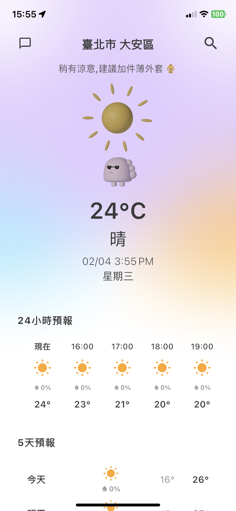
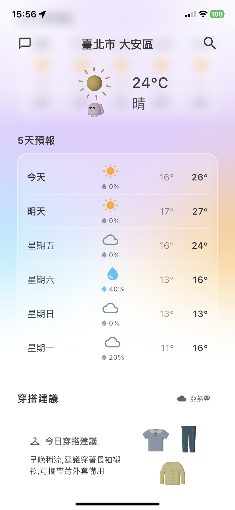
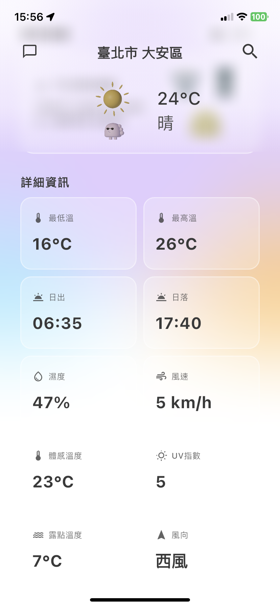
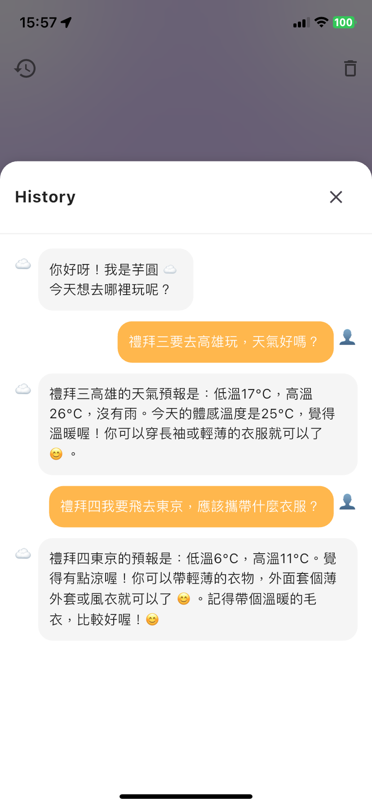
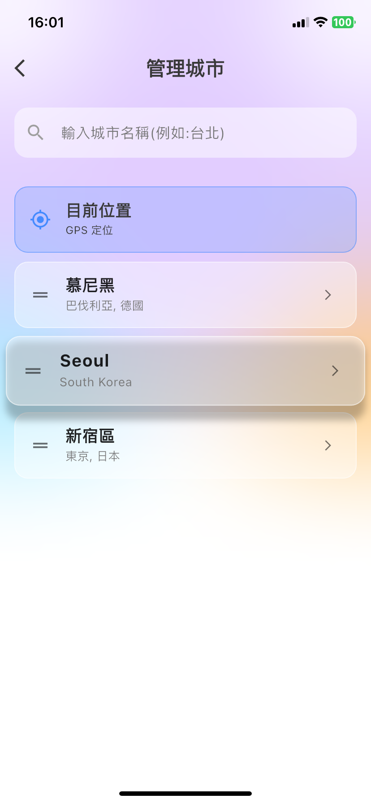

# Weather-Mate

為台灣氣候設計的智慧天氣 App  
結合官方氣象資料、3D 天氣角色動畫與 AI 穿搭助理

---

## 專案概念

台灣天氣變化快速、局部差異大，許多國際天氣 App 對台灣的精細度不足。  
本專案以 **CWA（中央氣象署）資料為主**，打造真正「在地優化」的天氣體驗。  
並透過動畫角色與 AI 對話，讓使用者能更自然理解氣象資訊。

---

## 主要特色

### 台灣在地化天氣系統
- 使用 CWA 官方氣象 API
- 支援「鄉鎮市區」等級定位
- 精準預報台灣地區天氣

### 國外天氣支援
- 使用 OpenWeatherMap API
- 支援國外城市與地標搜尋

### 天氣吉祥物動畫
- 自製 3D 吉祥物
- 會依當前天氣顯示不同動畫表現

### 預報功能
- 即時天氣
- 24 小時逐時預報
- 5 天預報

### 完整氣象資訊
- 溫度 / 體感溫度 / 濕度
- 風速 / 風向 / UV 指數 / 露點
- 日出 / 日落 時間

### 智慧穿搭建議系統

依據氣溫趨勢提供每日穿搭建議，將氣象數據轉化為實際生活決策。

### 氣候帶感知判斷（Climate-Aware Logic）

不同地區對相同溫度的體感差異顯著。
本系統透過 **使用者查詢地點的經緯度座標** 判斷所在地氣候區域，並加入氣候適應修正，讓穿搭建議更符合當地生活經驗。

例如：

台灣 10°C 可能需厚外套，北歐 10°C 仍屬可接受溫度

系統判斷流程包含：

依據經緯度計算所屬氣候區域（熱帶 / 亞熱帶 / 溫帶 / 北歐 / 極地）

根據區域套用「氣候適應溫度偏移值」

結合體感溫度、濕度與風速

產生情境式穿搭建議

### AI 天氣小幫手「芋圓」
整合 Groq AI，打造可對話的天氣助理，讓天氣資訊從「被動查詢」變為「自然對話」。

與一般聊天機器人不同，本系統的 AI 回答並非單純依賴模型知識，而是結合 App 內部即時氣象資料生成，確保回答內容與當前天氣狀況一致。

系統設計重點：

- 使用自然語言詢問天氣問題

- AI 回答基於 App 取得的即時氣象資料

- 避免與實際天氣數據脫節的通用回答

- 支援中英文對話

AI 並不直接作為資料來源，而是作為「氣象資料解釋層（Interpretation Layer）」存在於系統架構中。

### 中英雙語系統
- 支援中文與英文搜尋
- 自動切換介面語言

### 城市管理系統
- 裝置定位（Geolocator）
- 台灣鄉鎮市區搜尋（CWA 資料）
- 國外城市搜尋（OWM）
- 儲存 / 刪除 / 排序 使用者常用地區

---

## 技術架構

| 類型 | 技術 |
|------|------|
| 開發框架 | Flutter |
| 架構模式 | Repository Pattern（資料整合層） |
| 天氣資料來源 | CWA API、OpenWeatherMap（區域判斷整合） |
| AI 系統 | Groq API（基於 App 內部資料生成回答） |
| 定位系統 | Geolocator（Device Location Services） |
| 狀態管理 | Flutter Stateful Widgets + Asynchronous Data Flow |
| 本地儲存 | 使用者城市資料 |
| 測試平台 | iOS（實機測試） |
---

## App Preview

<table> <tr> <th align="center">即時天氣總覽</th> <th align="center">未來五日天氣預報</th> <th align="center">天氣細節資訊面板</th> </tr> <tr> <td align="center"></td> <td align="center"></td> <td align="center"></td> </tr> <tr> <th align="center">AI 天氣穿搭助理</th> <th align="center">AI 對話紀錄檢視</th> <th align="center">儲存地區管理</th> </tr> <tr> <td align="center"></td> <td align="center"></td> <td align="center"></td> </tr> </table>

---
